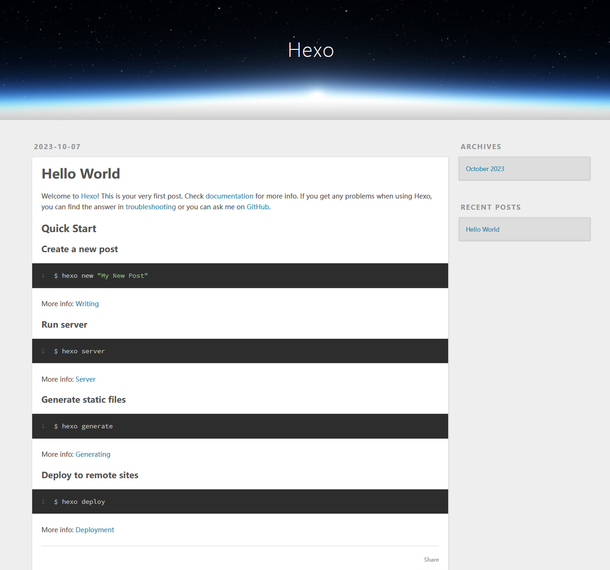

虽说是计算机网络内培要求的作业，但是已经想做一个博客很久了，来从0到1认真做一个属于自己的网站吧。:D

主要使用的是 hexo 博客框架，在阿里云上买了云服务器，不过在没有备案之前只能用 Github Pages 托管网页。

## 云服务器

### 选择

- 阿里
  - 轻量应用服务器：2核2G配置，108元/1年；
  - 轻量应用服务器：2核4G配置：297.98元/1年；
  - 通用算力型云服务器：2核2G配置：731.52元/1年；
- 腾讯
  - 轻量应用服务器：2核2G，112元/1年、540元/3年；
  - 轻量应用服务器：2核4G，218元/1年、756元/3年；
  - 轻量应用服务器：4核8G10M，388元/1年；
  - 标准型云服务器：2核2G，280.8元/1年；
- 华为
  - HECS云服务器：1核2G，23.13元3个月、64.56元/1年；
  - HECS云服务器：2核4G，103.09元/1年；
  - 通用型云服务器：2核4G，669.76元/1年；

先试试水用阿里云3个月的免费试用。实际是 200/月 抵扣额度，也不能买太贵的，能用的就是 1vCPU 2GiB 100Mbps。

### 系统

先进行一些安全性操作：

- 创建新账号 hyj 供后续使用

- 配置好 root 和 hyj 的密钥登录后，在 `/etc/ssh/sshd_config` 中

  - 关闭 `PasswordAuthentication` 密码登录，只允许密钥登录

  - 更改 ssh 端口 `Port` ，新端口记录在本地的 ssh config 中

    ``` plaintext
    Port 22
    Port X
    ```

    重启 sshd 服务 `systemctl restart sshd`

### 域名与备案

- 阿里云买了十年的 hyjack.cc，-￥700
  - 要求域名注册后也需要实名，否则域名处于 Serverhold 状态（暂停解析）
  - 可设置域名解析的 IP
  - 可选择云解析系统分配的 DNS 服务器
- 备案
  - 提供 IP - 域名
  - 命名与介绍不能使用：个人空间、爱好者、博客、导航、工作室、论坛、平台、热线、社区、社团、网络、网站、网址、主页、资讯、作品展示等词汇 doge
    - 个人笔记
  - 服务器需要是包年包月的包月3个月及以上付费模式，才能进行备案。现在试用暂时用不了

## Docker

后期考虑在 docker 内搭建博客

### 安装

先更新源，卸载任何的旧版本

``` plaintext
sudo apt update
sudo apt remove docker
```

直接用 [https://github.com/docker/docker-install](https://github.com/docker/docker-install) 提供的安装脚本，安装最新版

``` plaintext
sudo wget -qO- https://get.docker.com/ | bash
```

## Hexo 博客

Hexo 是一款基于 Node.js 的静态博客框架。

### 初步配置

``` sh
sudo apt install git npm nodejs
npm install hexo-cli -g
cd ~
hexo init blog  # 创建 blog 文件夹
cd blog
npm install
```

初始化之后的目录结构

``` plaintext
blog
├── _config.landscape.yml
├── _config.yml   配置文件
├── node_modules  依赖包
├── package.json
├── package-lock.json
├── scaffolds     生成文章的模板
├── source        存放用户资源
├── public        存放文章
└── themes        主题
```

搭一个简单能用的版本

``` sh
$ hexo generate
INFO  Validating config
INFO  Start processing
INFO  Files loaded in 249 ms
INFO  Generated: archives/index.html
INFO  Generated: archives/2023/index.html
INFO  Generated: archives/2023/10/index.html
INFO  Generated: index.html
INFO  Generated: fancybox/jquery.fancybox.min.css
INFO  Generated: js/script.js
INFO  Generated: css/style.css
INFO  Generated: 2023/10/07/hello-world/index.html
INFO  Generated: fancybox/jquery.fancybox.min.js
INFO  Generated: js/jquery-3.6.4.min.js
INFO  Generated: css/images/banner.jpg
INFO  11 files generated in 774 ms

$ hexo server  #
INFO  Validating config
INFO  Start processing
INFO  Hexo is running at http://localhost:4000/ . Press Ctrl+C to stop.
```

这样子就跑起来了一个 web 服务端，可以利用 VS Code 的端口映射 (Port Forward) 到本机端口，然后在自己的浏览器打开 `localhost:4000` 以访问这个界面。

自动的 generate 生成了：

``` sh
├── public
│   ├── 2023
│   │   └── 10
│   │       └── 07
│   │           └── hello-world     # 初始文章
│   │               └── index.html  # 初始文章页面内容
│   ├── archives
│   │   ├── 2023
│   │   │   ├── 10
│   │   │   │   └── index.html
│   │   │   └── index.html
│   │   └── index.html
│   ├── css
│   │   ├── images
│   │   │   └── banner.jpg
│   │   └── style.css
│   ├── fancybox
│   │   ├── jquery.fancybox.min.css
│   │   └── jquery.fancybox.min.js
│   ├── index.html
│   └── js
│       ├── jquery-3.6.4.min.js
│       └── script.js
├── scaffolds
│   ├── draft.md
│   ├── page.md
│   └── post.md
├── source
│   └── _posts
│       └── hello-world.md  # 初始文章的 readme
...
```

> #### nodejs 与 npm 的版本
>
> NodeJS 是 JavaScript 的一个运行环境，让JavaScript 运行在服务端的开发平台；而 npm (Node Package Manager) 是 NodeJS 的包管理和分发工具，二者需要对应版本。
>
> 搞的过程中需要更新 nodejs 版本，使用了 [nvm](https://github.com/nvm-sh/nvm) 来安装更新的版本。nvm 安装其他版本的 nodejs 相当于在 `~/.nvm` 下维护一个虚拟环境，同时也安装了对应版本的 npm
>
> ``` sh
> $ nvm ls-remote  # 查看可用版本
> $ nvm install 18
> $ nvm use 18
> $ node -v
> v18.18.0
> $ which node
> /home/hyj/.nvm/versions/node/v18.18.0/bin/node
> $ npm -v
> 9.8.1
> $ which npm
> /home/hyj/.nvm/versions/node/v18.18.0/bin/npm
> ```

### Github Pages 部署

服务器先配置 git + github ssh

``` sh
git config --global user.name "yourname"
git config --global user.email "youremail"
ssh-keygen -t rsa -C "youremail"
cat ~/.ssh/id_rsa.pub
```

复制 `ssh-rsa .....` 到 Github \> Setting \> SSH and GPG keys。确认：

``` sh
ssh -T git@github.com
```

接下来将 hexo 生成的文章部署到 GitHub 上

先在 github 创建一个仓库（一般博客都是 `<USERNAME>.github.io`），修改 `_config.yml` hexo 配置文件，修改 deploy 部分：

``` yaml
deploy:
  type: git
  repo: https://github.com/XXX/XXX.github.io.git
  branch: master
```

``` sh
cd ~/blog
npm install hexo-deployer-git --save
hexo clean
hexo generate
hexo deploy
```

然后就可以在 `https://hyjack-00.github.io` 访问我用 hexo 生成的网页啦😊。



以上是 `https://hyjack-00.github.io/2023/10/07/hello-world/` 的页面内容

这里用的是 GitHub Pages，是 GitHub 提供的一个免费静态网站托管服务，允许用户将他们的代码仓库转化为一个在线可访问的网站。git deploy 把服务器上的页面 push 到了上面建立的仓库中，实际上访问的是 github 而不是我的云服务器。

### 服务器部署

在服务器上启动 hexo server 后在 4000 端口开放，可能需要在阿里云安全台开一下端口，只在服务器设置不行

于是因为没有备案几分钟就被封啦~，先看看远方的 Github Pages 吧家人们 QAQ。

### 创建文章

``` sh
$ hexo new "Hyjack 的博客搭建"
INFO  Validating config
INFO  Created: ~/blog/source/_posts/Hyjack-的博客搭建.md
```

然后就在你的 markdown 文档里大写特写就行咯。开头 `---` 括起来的部分叫做 Front-Matter ，用于指定文件的变量参数。

写完之后从 markdown 生成页面就行：

``` plaintext
$ hexo g
$ hexo d
```

## Ref

hexo 史上最全搭建教程 [https://blog.csdn.net/sinat_37781304/article/details/82729029](https://blog.csdn.net/sinat_37781304/article/details/82729029)

hexo 官方文档 [https://hexo.io/zh-cn/docs](https://hexo.io/zh-cn/docs)

hexo 部署到云服务器 (Nginx) [https://blog.51cto.com/u_16099196/6703821](https://blog.51cto.com/u_16099196/6703821)
