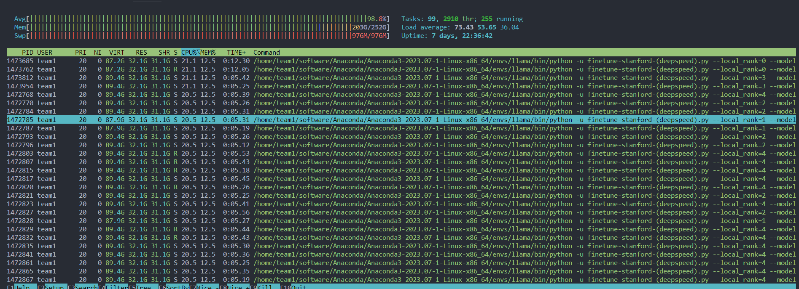
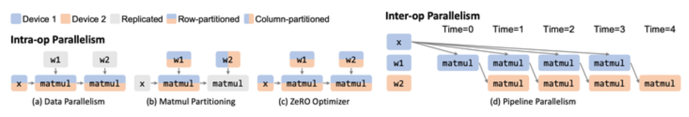

## 初赛

主要负责 llama 任务，帮忙 WRF-Hydro 任务。任务包括 LLaMA-13B 部署、推理性能测试、最重要的微调加速、微调后验证。推理部署验证那些的难度不大，主要就是在学习接口，搞环境。主要工作就是在微调那边了。

### 环境

硬件上是 2 \* AMD EPYC 7763 64-Core，5 \* A100 80G。

使用 Anaconda 虚拟环境来管理 python 相关包，用 spack 等来实现 cuda 库等基础环境管理，使用 shell 脚本混合加载。conda - spack 混合使用似乎存在不兼容，但 AI 相关的依赖链很简单暂没有观察到问题。python 的包很多，再用 Spack 管理 python 库似乎有点折磨？没试过。

后期需要至多 3 个版本的 cuda 以及 cudnn 等基础库，就我的使用而言 spack 还是很好用的，完全不用管依赖版本问题，安装一堆东西的时候也可以放手干其他的事情。spack 内部依赖滴水不漏，会跟进 bug 补丁与更新；但你用的时候可能会漏一些环境变量，可能需要手动加载动态链接的 `LD_LIBRARY_PATH` 等环境变量。

但 spack 能帮我自动编译安装，自动管理多版本安装文件夹，这就已经很好用了。

### 微调

暑假 7 月只是做完了环境和部署，然后更新了一下自己的 AI 知识，大概学到了 transformer。8.5 开始正式搞微调，半个月不到感觉把 LLM 微调加速相关的内容都学的差不多了，虽说最后也没训多快吧，但是探索了很多内容还是很有成就感的，也算是给我开拓了 LLM 的这个学习方向。

刚开始 LLaMA 官方的训练脚本一直跑不通，而且报错也只有进程被终止，捣鼓了一阵才在 htop 看到内存被逐渐填满溢出然后一下子被清空了。似乎主存溢出被系统进程 kill 是不会有具体报错的。看看爆满：



有两个地方会内存高占用导致溢出：一是从硬盘载入模型时，二是模型训练时。

- 前者是因为 `torchrun` 在分布式启动的每一个进程都会独立载入模型，而且都以 FP32 存储，占用空间很大。每个进程需要 13 x 4 = 52 GB，5 张卡共 5 个进程需要至少 260GB 内存，已经超出了机器的内存大小。

  这一点可以使用 HF Accelerate 库提供的多设备加载接口来实现，直接将模型提前划分，然后分离加载到 GPU 显存、内存甚至 NVMe 上。

- 后者就是单纯的显存占用高，如果使用 Deepspeed Zero-3 从显存 offload 回主存，就反而把主存爆了。这部分的显存大小很难再压缩，需要改代码了，合理的方式就是充分平衡 GPU 和 RAM，见后文。

关于并行方式我跑通的有：

- LLaMA 官方训练脚本 + pytorch FSDP
- HF transformer + pytorch 库提供的横向分层模型并行 MP
  - 最快，但并没有实现真正的并行
- Deepspeed 训练框架的零冗余并行 ZeRO + offload
  - 这里很难受，一直在妥协
    - ZeRO-2 爆显存
    - ZeRO-3 爆显存
    - ZeRO-3 + offload RAM 爆内存
    - ZeRO-3 + offload NVMe 没有SSD权限（好像就没有 NVMe？）
    - ZeRO-3 + offload RAM (only gradients) 终于搞好了，这相当于把显存占用中 optimizer 的参数留在 GPU，offload 只针对模型参数。但是这样换入换出的性能损失很大，速度已经远没有 MP 快了。

这里对并行方式的理解有横向划分和纵向划分的说法。其实就是把整个模型网络从上到下画出来：如果是竖着切开一个 layer 里面的张量就是纵向划分，通常是在不同卡上各自存放一部分数据，需要卡间通信；如果是横着切开模型网络的不同层分配到不同卡上，就是横向划分，通常就是让输入数据 stream through 各个卡。

5 张 A100 之间并没有 NvLink，如果每个迭代都需要进行模型参数的通信，通信代价会很高。所以 Tensor Parallelism, ZeRO, FSDP 这些方法在理论上是很慢的，实测符合这一点猜测。所以当时考虑的唯一可行的改进是使用 Pipeline Parallelism 并行，但是这需要改动模型本身的结构，目前找到的库均没有支持 LLaMA 的流水线并行。

找到了 Alpa 这个新库，统一了所有的并行方式，横向对应算子间并行，纵向对应算子内并行，具体策略可以自动设置。但是它截至 2023.8 不支持 LLaMA 啊 = =。



没有尝试 Megatron，这个东西虽然更完善，上述提到的并行方式都是可行的，但主要用于预训练而不是微调，而且更适用于大规模的 GPU 集群，我们这还是小了点 QwQ。

现在感觉自己学会了微调之后可以自己 develop 自定义的模型了，未来有点想做一个电子小人 LLM，只要 A100 还在就能慢慢整，嘻嘻~

## 决赛

任务主要是在 GSM 小学数学题的数据集上对 llama 进行训练，然后让 GPT3.5 出数学题给 llama 来回答。属于是很有意思的任务，确实是跟超算比赛没什么关系，毕竟最终只看功能结果而不是性能结果，但也有像真实参赛一样学到了一些经验。

### 时间规划

比赛就是早八到晚八共 12 小时，按初赛的经验完整跑一次需要的时间比较多，时间规划很重要。

上午一直在捣鼓怎么使用这个 GSM 数据集。刚开始就是自己用 python 写一个训练循环的脚本，用了最简单全参数 fp16 微调 + 模型并行，可以直接跑通。之后想用 huggingFace 提供的 trainer 来进行更复杂的训练，但是一直有 CUDA 那边的报错。对比来说应该是数据集处理格式的问题，但是一直到下午两点都没有搞通。

感觉已经花了很多时间去搞这个了，下午两三点的时候决定直接训练到底。最后 1 epoch 稳定用时 40 min，加上 evaluation 最后 5h 共训练了 6 epoches。有意思的是我们为了避免大崩，每跑一个 epoch 就 checkpoint 一次，然后对当前结果跑一次 evaluation，也就是跟 GPT 进行一下问答测试。只要我保存下来模型权重，队友那边立即运行脚本，运行完我再立即启动下一 epoch 训练，整了个无缝流水线 hh。

来看看一个尚未训练好时的 interesting 对话，当时 xswl，他是懂讽刺的：

``` plaintext
GPT3.5: This is the next question: ...
LLaMA:  https://stackoverflow.com/help/how-to-ask-a-good-question
```

时间规划总的来看还不错，epoch 6 的效果相对 epoch 5 已经提升很小了，所以刚好够用。上午尝试加快训练进程失败后，转到用基本方案训练还算及时。但是我们也在想，如果从上午就直接开始训练，会不会更快一点🤔。

### LLM 交互

队友会用 OpenAI 的 API，所以交互脚本主要是他们来写。具体涉及了一些 Prompt Engineering，比如在数学题那边引导 LLM 去分步骤解答问题，就是之前比较火的思维链 Chain-of-Thought。

在尝试的过程中，我也有一些对 LLM 的新的想法：

pretrained 模型只是一个续写者，大规模语料的训练目标大概就是让模型能够在给定上文的情况下去预测下一个词是什么，而模型学到的也就是对文本进行续写。与训练好的 ChatGPT 那些不同，预训练模型明显只是单纯地在补全输入文本，很难有固定的模式来进行交互式应答。llama 原版模型在面对 `Human: ... Assistant:` 这样的 prompt 时就表现得很奇怪，甚至会自动补全到下一个 Human 的回答。

微调实际上就是在让 LLM 明确自己要干什么，比如我们的 Stanford Alpaca 和 GSM 数据集，明确是其中一方给出问题 / 指令，它回应言论的续写模式，所以叫做 Instruction-Finetuning。一个被广泛接受的说法是，模型预训练被喂的数据其实是超出我们想象地多的（已经充分压缩了足够的信息），只是需要少量的微调数据集引导模型去以我们想要的方式续写，从而真正利用训练过的数据。

这么看的话，思维链、回答中的自我认知这些近似于人类思考特征的东西其实是比较表象的，属于是模型在模仿交互式对话时自然展现的，并不存在所谓 LLM 的人格。或者说是模型 “认为” 在续写时应该以演绎一个人格的样子来给出回应。不过反过来看我们人类，也不过是在复读与续写罢了~ 说不定只是我们过于自信地 “认为” 存在自我。

> 我觉得自我认知，是在 “是否存在智能” 这种问题上最需要考虑的 topic。6 个月大的婴儿虽然智力不如大猩猩，却可以从镜子中辨认自己的形象，我们自我认知的能力似乎是先天的，而不是在社会语言环境中学到的。LLM 从后天文本记录里模仿出来的 “人格” ，和我们生物学上先天产生的自我认知，有本质上的区别。
>
> 但是我们在学会用语言进行表达后所描述的后天自我，和先天的自我认知有没有区别呢？LLM 对人类语言暗含的自我认知的演绎模仿，能不能达到和生物学智能相同的表观功能呢？不好说，我只知道我跑题了~

### Hindsight

- 决赛虽然放开了 finetuning 方法，允许杂七杂八的 PEFT 方法，但是由于没法使用 HF 的 trainer 就没法用他们的 peft 库，比较可惜。
- 做到下午两三点有种感觉，自己不明确自己在做什么。之前打其他短时间的比赛也会有这种感觉，可能是时间比较紧凑而自己一直没有进展，压力比较大。

## 感受

感觉我在口头交流的时候真的很不喜欢说正面的内容。当时答辩完总结的时候我记得自己最后一句是很难受，但这其实是在描述其中一部分的内容，忘了最后再补一句总体感受。其实我还是很喜欢这么一次比赛的，这相当于也是接触了一个新领域了，而且是平时绝对不会接触到的领域，如果不是这边提供的 5 张 A100 我估计不太有机会能训练一个百亿参数级别大模型了，学习实践的过程有很多有意思的事；另外也学到了很多服务器系统上的经验性技巧，也暴露了一些我的问题，后面打算看看队友们的任务是怎么做的~

还有就是说我们队比较稳定，而隔壁 team2 比较激进。我确实是属于特别求稳的风格，感觉可以多学习一下隔壁的思路。

总的来说，A rewarding challenge of exploration and growth.
