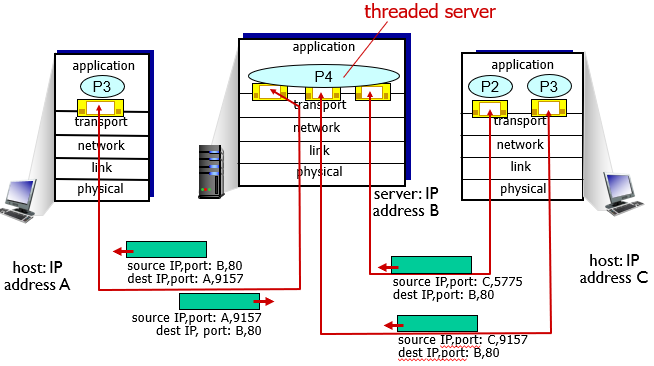
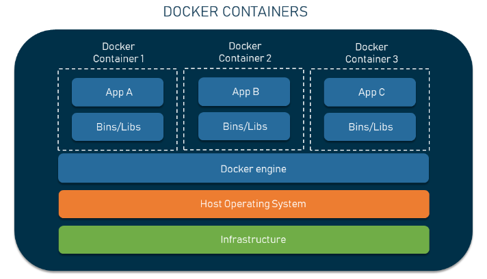

分布式系统真是个抽象的课，虽然与 OS 有很多交叉知识，但是讲的方式是更高层、抽象、体系化的。

老师讲了很多拓展的东西，有一些像计算反射这样的偏应用领域知识，我平时是不会主动了解的，有一些则是把之前的概念都串了起来，相当于体系化地整理了一遍，比如 ISA - ABI - ABI 的接口层级。上课时有很多新知识，我如果认真理解也能有一些新的想法，还是很值得听的。

本文就是最近在讲到虚拟化的多路复用时出现的想法。

## Traditional Def

Wiki definition:

> **多路复用**（Multiplexing，又称“**多任务**”\[[来源请求\]](https://zh.wikipedia.org/wiki/Wikipedia:%E5%88%97%E6%98%8E%E6%9D%A5%E6%BA%90) ）是一个[通信](https://zh.wikipedia.org/wiki/%E9%80%9A%E4%BF%A1) 和[计算机网络](https://zh.wikipedia.org/wiki/%E8%AE%A1%E7%AE%97%E6%9C%BA%E7%BD%91%E7%BB%9C) 领域的专业[术语](https://zh.wikipedia.org/wiki/%E6%9C%AF%E8%AF%AD) ，在没有歧义的情况下，“多路复用”也可被称为“复用”。多路复用通常表示在一个[信道](https://zh.wikipedia.org/wiki/%E4%BF%A1%E9%81%93) 上[传输](https://zh.wikipedia.org/wiki/%E4%BC%A0%E8%BE%93) 多路[信号](https://zh.wikipedia.org/wiki/%E4%BF%A1%E5%8F%B7) 或[数据流](https://zh.wikipedia.org/wiki/%E6%95%B0%E6%8D%AE%E6%B5%81) 的过程和技术

多路复用的概念出现在网络与通信领域，大致就是利用一条通信线路复用给多条线路，有大概几种实现方法：

- 时分复用的特点是：高速信道根据时间划分成多个[时隙](https://zh.wikipedia.org/w/index.php?title=%E6%97%B6%E9%9A%99&action=edit&redlink=1) 供多个低速信道轮流使用，在一个时隙内，只能有一个低速信道占有高速信道的资源。
- 频分复用的特点是：多路复用器将各个低速信道的信号通过[调制](https://zh.wikipedia.org/wiki/%E8%B0%83%E5%88%B6) 分布到高速信道的各个[频段](https://zh.wikipedia.org/wiki/%E9%A2%91%E6%AE%B5) ，然后进行叠加，形成高速信道上传输的信号，在接收端，分路器一般通过[带通滤波器](https://zh.wikipedia.org/wiki/%E5%B8%A6%E9%80%9A%E6%BB%A4%E6%B3%A2%E5%99%A8) 分离各个频段，然后转发给对应的低速信道。

在本文中通信多路复用不是重点，想探讨的是这个概念的本质，推广到其他领域。

多路复用的本质是物理资源的同时重用。由于信道数目较少而建立连接的用户比较多，需要利用单一的物理信道资源分配给多个用户；而通信这件事常常是要求即时性的，这种划分应该能够达到一个透明性的效果，让用户感受不到物理资源是被划分的，就像是每一个用户都立即独占了物理信道一样。

时分复用就是利用更短的时间片切换实现了人类感受不到的复用，频分复用则是真正将信号成分叠加在一起进行传输。它们都是利用同一个物理资源实现同时多个使用的方法。

## Network Transport

网络协议层级的传输层（Transport Layer: 即 TCP UDP 协议所在层）也是基本在做一种 Multiplexing。

一般来说，IP 协议所在的网络 network 层负责主机 host 之间的通信，而 TCP 与 UDP 协议所在的传输 transport 层负责进程 proc 之间的通信。实际上一台主机通常只有一个网卡，通过一条网线连接出去，即使不只一个网卡也不可能比得上进程的数量。在只有一个网络连接的底层物理资源的情况下，想要让多个进程都连上网络，也需要进行多路复用。

当前的解决方法是在主机的 IP 地址上，再加入端口号 port 以用于区分主机上的不同进程。具体也是通过时分复用实现的。

- 在本机发送数据时，多个进程使用不同 port 发送的数据，同时让 transport 层上 multiplex 给同一个 IP 传输
- 在目标接收数据时，不同数据包根据目标 port 再进行 demultiplex，再分配给不同的进程

对于上层的应用进程来说，多路复用的端口网络传输似乎是不存在的、透明的，就像是进程独占了整个 IP。

## Virtual Machine

虚拟化的本质也可以说是一种软硬件的多路复用，尤其是 docker 容器。

一个主机的物理资源只有一份，而我们有在上层虚拟化出更多系统的需求。这要求我们对所有物理资源，包括处理器、内存、磁盘、其他IO 等，进行多路复用，使得多个虚拟化的系统同时运行在一个物理主机上。

对于 docker 容器来说这种概念显得更明显，一个服务器可以同时运行几个 docker 容器系统，底层通过调度程序，即 docker engine，以时分切换方式来实现多路复用。相当于把唯一的硬件多路复用给不同的软件操作系统。

虚拟机内部，几乎就像是一个完全运行在物理机器上的操作系统，就像这个虚拟机独占了所有的物理资源。

> 这么说的话，并发多线程也能看作是把处理器资源 时分复用 给多个软件进程/线程

以上，我们可以看到多路复用的概念可以扩展到很多计算机领域，它的思想本质是在只有少量的物理资源的情况下，以特殊的复用方式，实现多个上层用户同时的使用，看起来像是有充足的物理资源。
