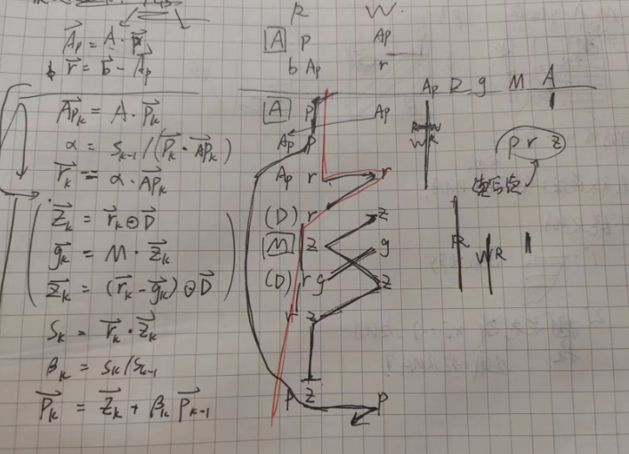
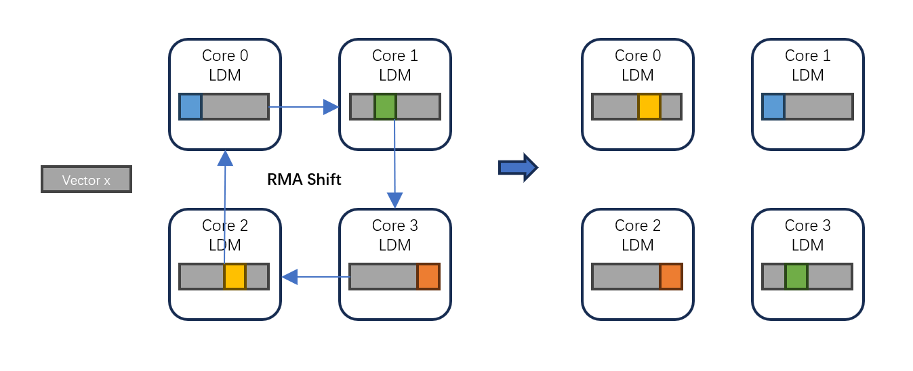
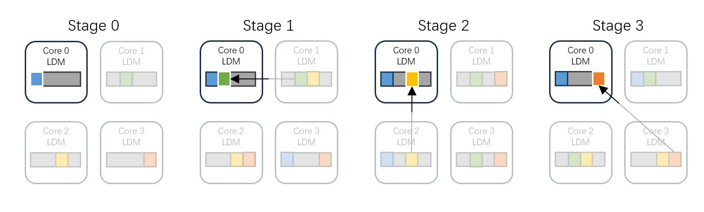
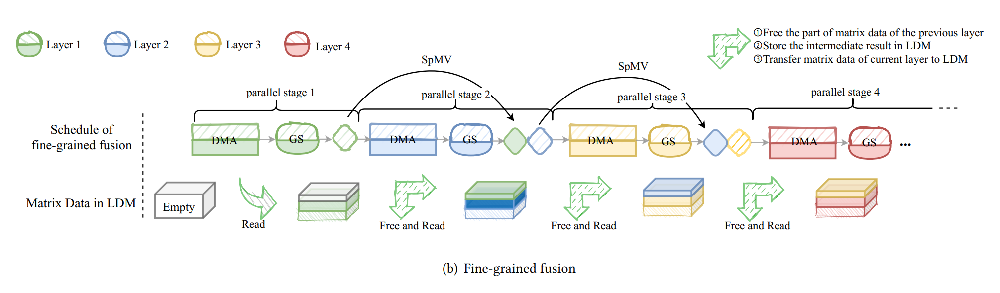
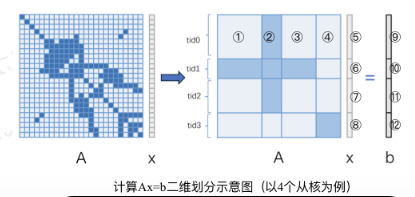

## Task

### Hardware

在神威的下一代（其实就是当前一代）处理器的一个核组上做优化，整个集群叫做 “问海一号”，处理器暂时还找不到名称信息。

主要的硬件特性：

- 一个核组有 1主核 + 64从核
- 从核的 256KB 片上数据存储可分大小配置为 LDM局部存储、SLDM共享局部存储、D-cache透明缓存
- 数据传输有全局主存访问、主存到LDM的DMA、LDM之间的RMA。

### Algorithm Analysis

题目是用预处理 PCG 算法解方程，处理对角占优矩阵的数据。

分析一下算法流程，只考虑数据流与算子。注意矩阵需要提前转为 csv 形式存储，包括 `data[], col[], rowptr[]` 三个成员，但这个转化的过程比较难上从核，所以在这里忽略了。

- baseline 转化为伪码

  （这种分析应该只能对比较小的题目做，大的程序想做函数外的 fusion 之类的优化感觉会很复杂）

  ``` cpp
  input: A {A.rowptr[N] A.col[nnz] A.data[nnz]}  b[N]  x[N]

  // pcg_init_precondition_csr() M 矩阵拆分成对角线和其他元素
  D[N] = 1 ./ diag(A)[N];
  M.data[nnz] = A.data[nnz] | 对角线取 0;
  M.col[nnz] = A.col[nnz];
  M.rowptr[N] = A.rowptr[N];

  Ap[N] = A * x[N];     // spmv()
  r[N] = b[N] - Ap[N];
  residual = Sum(fabs(r[N]));   // pcg_gsumMag() 归一化残差范数

  it = 0;
  do {
      if (it == 0) {
          // pcg_precondition_csr(): z[] = M-1[][] * r[]
            z[N] = r[N] .* D[N];          // v_dot_product()
            g[N] = M * z[N];              // precondition_spmv()
            z[N] = (r[N] - g[N]) .* D[N]; // v_sub_dot_product()
          s = r[N] * z[N];   // pcg_gsumProd() 点积, alpha 的分母

          p[N] = z[N];
      }
      else {
          s_ = s;    // rk-1[] * zk-1[]
          // pcg_precondition_csr(): z[] = M-1[][] * r[]
            z[N] = r[N] .* D[N];          // v_dot_product()
            g[N] = M * z[N];              // precondition_spmv()
            z[N] = (r[N] - g[N]) .* D[N]; // v_sub_dot_product()
          s = r[N] * z[N];    // pcg_gsumProd(), rk[] * zk[]
          beta = s / s_;  // betak-1 = rk-1[] * zk-1[] / rk[] * zk[]

          p[N] = z[N] + beta * p[N];  // pk[] = zk[] + betak-1 * pk-1[]
      }

      Ap[N] = A * p[N];  // spmv()
      alpha = s / (p[N] * Ap[N]);  // pcg_gsumProd()
                                   // alphak = rk[] * zk[] / pk[] * A[][] * pk[
      r[N] = r[N] - alpha * Ap[N];  // rk[] = rk-1[] - alphak (A[][] * pk[])
      x[N] = x[N] + alpha * p[N];   // xk[] = xk-1[] + alphak * pk[]

      residual = Sum(fabs(r[N]));
  }
  while (it < maxIt && residual / norm >= e);
  ```

- 简化一下循环逻辑，便于分析

  ``` cpp
  init(D[N], M.data[nnz], M.col[nnz], M.rowptr[N], Ap[N], r[N], residual);

  s = INF;
  while (...) {
      s_ = s;
      // pcg_precondition_csr(): z[] = M-1[][] * r[]
      z[N] = r[N] .* D[N];          // v_dot_product()
      g[N] = M * z[N];              // precondition_spmv()
      z[N] = (r[N] - g[N]) .* D[N]; // v_sub_dot_product()
      s = r[N] * z[N];   // pcg_gsumProd() 点积, alpha 的分母
      beta = s / s_;  // betak-1 = rk-1[] * zk-1[] / rk[] * zk[]
      p[N] = z[N] + beta * p[N];  // pk[] = zk[] + betak-1 * pk-1[]

      Ap[N] = A * p[N];  // spmv()
      alpha = s / (p[N] * Ap[N]);  // pcg_gsumProd()
                                   // alphak = rk[] * zk[] / pk[] * A[][] * pk[
      r[N] = r[N] - alpha * Ap[N];  // rk[] = rk-1[] - alphak (A[][] * pk[])
      x[N] = x[N] + alpha * p[N];   // xk[] = xk-1[] + alphak * pk[]

      residual = Sum(fabs(r[N]));
  }
  ```

- 为了让数据尽可能多地放在 LDM 而不是和主存之间搬来搬去，当时对这个数据流进行了一些分析

  

  - 左侧一列是操作，中间一列是操作需要读写的数据，右侧一列是各数据需要在场的时段
  - 写这个主要是为了找到可以共用同一份空间的数组
    - 比如上图中 `Ap` 是可以跟 `g` 用同一片 LDM 空间的，而且中间有一个计算应该也够时间访存切换
    - 还有 M 的 col, rowptr 和 A 是一样的，仅仅只是对角线清零，可以共同存储很多东西

## Methods

其实都是面向异构设备的优化方法

### Coding Journey

- 刚开始就是一个个把函数改到从核上去并行计算，如果数组过大就直接放到共享空间里

- 之后就主要搞 profile 了

  - perf 出来发现是 SpMV 占巨大头
  - 之后一直在测试 DMA, RMA 那些的带宽速度，没什么进展

- 计算流程很简单，自动向量化没有提升，加了个访存的双缓冲有所优化

- 矩阵 A 可以拆分到不同从核的 LDM 上独立计算，可以考虑让这部分矩阵一直留在 LDM。

  后续问题在于：在计算 A \* x 的 SpMV 时稠密向量 x 的访问是根据 `A.col[i]` 随机索引的，每个核心都需要能获取到所有的 x，但实际上 x 太大了没法塞进单核的 LDM。

  - 一方面是队友在做的方法，基于共享内存存储 x，做细节的 fusion 优化

  - 另一方面是我这边在干。也是合并成一个大的从核 kernel，另外听学长说的尽可能把其他的数组也保留在 LDM 上面，减少访存次数。

    对向量 x 想法是切分放在不同的 LDM 里，通过手动 RMA 获取实现更细化的控制。

    - 刚开始的想法是对 x 做核间流水：在从核之间串起来一条循环的数据线路，然后每个小流水阶段就往前推一次数据 (Shift)，这样让 x “流过” 各个从核，与从核保留的 A 的那一部分相乘。

      

      写着写着就发现太天真了，有致命的问题：

      1.  负载不均。这样子玩需要在 Shift 时进行全部从核的同步，一旦有一点点负载不均都会导致全部从核的计算浪费。
      2.  Shift 需额外空间。如果想让 RMA 全都同时发生，需要在存储当前的 \$x_i\$ 的同时，再多留出相同大小的缓冲区来接收上一个从核发送过来的 \$x\_{i-1}\$。对一块内存，没有办法同时进行发送和接收。于是 x 存储占用再翻倍，再结合双缓冲就需要三倍了。

    - 于是换了思路，x 一部分数据就保留在本地，让需要数据的从核自己去把对应位置数据取过来。而且让不同从核从自己这一块的 x 开始算，避免多从核请求同一块 LDM。

      

      实现出来之后感觉效果很慢，寄了。性能分析并没有什么显著的结果，发现是虽然是其他需要访存的小函数快了，但是 SpMV 拖慢很多得不偿失。

      > 注意热点函数才是主优化点，其他优化尽可能不要对主优化点有副作用 ！

      我猜测的原因是在于：因为限制了每个流水阶段只访问一个范围的列索引，对 `A.data[]` 的访问只是分段连续的。

    - 于是又提前对 `A.data[]` `A.col[]` 作了重排，使得每个流水阶段是连续访问的。速度有一定提升。后来转念一想这其实就是把 CSV 提前进行了分块预处理，意义大吗…

    - 后来就中道崩殂了

### Strategy Summary

- 重叠计算和访存

- Kernel-fusion

  - 最简单的就是单 kernel-function 化，减少主核 launch overhead

  - 更复杂的流水化 “计算+加载”，见 sc21_sunway_hpcg

    

- LDM 存储管理（一次算法迭代 / 一次内数据加载迭代）

  - 针对主要算子，SpMV 时使用几乎全部存储的空间，计算前后立即一次性传输全部数据

  - 存储更多的数组，每个算子使用的存储更少，一次大循环还需要多次从主存取数据

  这里其实有一个平衡，并不是说 LDM 存的越多越好。我们的最终目标应该是访存耗时尽可能被覆盖，如果用的 LDM 过多反而挤掉了其他数组，反而是没有意义的。

- 对向量 x 的处理：SpMV 需要随机访问一整个大向量 x，每个核心都需要能获取到所有的 x，但实际上 x 太大了没法塞进单核的 LDM

  - Share x 使用多核共享空间统一编址

  - RMA Distributed x 不同核间分布存储 x，需要时用 RMA 取得

  RMA 其实本质上就是手动实现了 LDM 共享内存，可以多想想优化技巧，否则无法超越 Share LDM。

- 注意，如果使用分布式存储大向量，你需要让行列方向有相同的划分。因为 Ax=b 时 b 是按行划分的，而这个结果传递到下一个 SpMV 中其实是 x，也就是按列划分。

### Imporvement

一些没有想到 / 做到的方法

- 单独处理**对角线**元素：由于矩阵性质，对角线可以直接稠密计算；另外这样也可以让 M 和 A 的 data 使用同一个存储空间。

- 在 RMA 取数据的时候其实并不需要把对面所有的 x 都取过来。矩阵基本是对角占优的，旁边很稀疏。可以考虑一个**访存密度阈值**，超过这个阈值才按大块来 RMA，稀疏情况下只需要单个取数即可（来自冠军的做法）

- 在划分 x （划分列索引）的时候也可以考虑负载，提前统计数据量再进行划分。

  

- 一直想的都是把矩阵 A 分离存储后就放在从核上，避免再次访存。但其实矩阵 A 用的时候多次访存也不是不行。

  比如 A / 64核 / 4阶段，每个 SpMV 都要访存 4 次。但是更小的访存量可以更好地异步调度，第一个循环用之前的计算来掩盖，后面的循环用上一个循环来掩盖。这样就可以用之前的小 kernel 来掩盖一部分大 kernel 的大量访存。

## Hidesight

### Questions

我觉得这一篇回顾已经花了我不少时间了，目前仅提出问题即可，尚无时间仔细研究

- 编译器对指令的数据流是怎么分析的？能否自动实现更高层面的数据流依赖分析，以更方便地写 kernel-fusion？甚至直接自动得到最好的 计算传输重叠 + 内存分配方案？

- 怎么确定哪些数据持续放到局部缓存比较好？

  - 根据数据使用情况来决定，如果数据需要的间隔比较大，则可以暂时换出；
  - 总体思路还是尽可能多地都放在 LDM 里

- 精细考虑的时候从 计算带宽 - 传输带宽 的 Ratio 入手

  - 计算强度 (arithmetic intensity) = 峰值算力 \$\pi\$ / 访存带宽 B (FLOPS/Byte)，但是这个值到底要怎么用起来
  - DMA 总带宽是定值，可以调取尽可能多的核心来让 \$\pi \> B\$ ，剩下的核心可以考虑作为存储 / 传输的辅助？

- 测带宽感觉有一些困难

  - 用来当 benchmark 的程序是什么？

    - 纯读、纯写、vcopy 读写、vadd / saxpy 读写计算？测出的带宽可能有区别，读写会互相干扰，那具体哪个才是实际使用时的带宽？

  - 测带宽和测延迟有什么区别

    - 都是多次循环访存，利用计时推算出带宽 / 延迟

    - 区别好像只在于访问数据模式，**大数组连续访存受带宽限制，随机单点访存受延迟限制**

      > **Interesting，所以像本题中对矩阵 data, col 的连续访问是带宽受限的，而对向量 x 的随机访问应该是延迟受限的**。

      我的理解是大规模连续传输的时候存在传输合并、异步传输、预取等，所以实际上并不是等待一个传输完再传第二个，所以没法测得真正的传输延迟，而是连续访存时的带宽。

    - 另外为了避免受缓存命中影响，测延迟也需要比较大的数组

### Mistakes

- 没有理解 DMA 可以只有一个控制器，传输速率只与数据带宽相关，没有并行提升
  - 所以多核并行 DMA 传输没有总带宽的提升
- 异构平台上的热点函数可能是不准确的，可能包括了从核空转的时间
